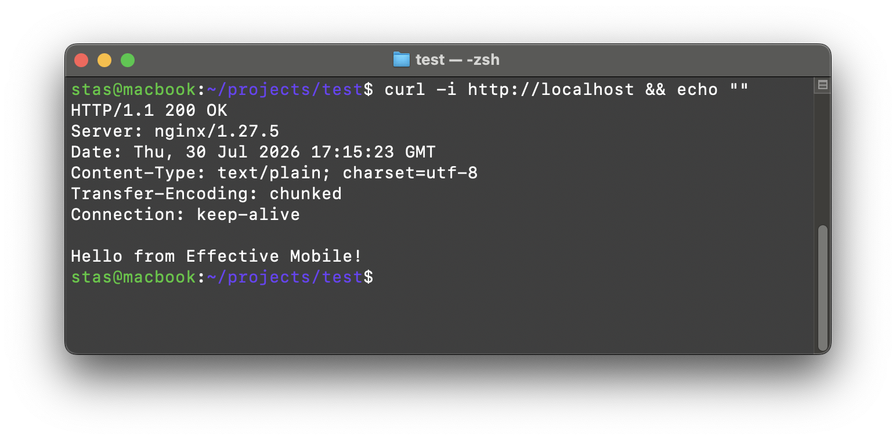

# Тестовое задание

Минимальное приложение на Python (`http.server`), спрятанное за nginx как reverse proxy,
поднимается через Docker Compose.

# Результат 



## Структура проекта

```
├── backend/
│   ├── .dockerignore
│   ├── Dockerfile
│   └── app.py
├── nginx/
│   ├── .dockerignore
│   ├── Dockerfile
│   └── nginx.conf
├── .dockerignore
├── .env
├── .gitignore
├── docker-compose.yaml
└── README.md
```

## Как запустить

Требуется установленный Docker и Docker Compose (`docker compose` или `docker-compose`).

```bash
git clone https://github.com/extekky/test.git
cd test
docker compose up --build -d
```

Это соберёт два образа (`backend`, `nginx`) и поднимет два контейнера:
- `my_backend` — Python HTTP сервер, слушает 8080 **только внутри** docker сети
  (порт наружу не пробрасывается)
- `my_nginx` — nginx, слушает порт из `NGINX_PORT` и проксирует запросы на
  service name `backend`

## Как проверить результат

```bash
curl http://localhost
```

Ожидаемый ответ:

```
Hello from Effective Mobile!
```

Также можно открыть `http://localhost` в браузере.

Посмотреть логи:

```bash
docker compose logs -f
```

Остановить и удалить контейнеры:

```bash
docker compose down
```

## Как работает схема

1. Клиент делает запрос на `http://localhost` (порт 80 на хосте).
2. Docker Compose пробрасывает этот порт в контейнер `nginx`.
3. Nginx (конфиг `nginx/nginx.conf`) принимает запрос на `location /` и
   проксирует его через `upstream backend_upstream` на контейнер `backend`
   по внутреннему DNS имени `backend:8080` (имя сервиса из `docker-compose.yaml`
   в сети `my_network`).
4. Backend (`backend/app.py`) — простой Python HTTP-сервер на `http.server`,
   слушает `0.0.0.0:8080` и на любой GET запрос отвечает текстом
   `"Hello from Effective Mobile!"`.
5. Nginx возвращает этот ответ клиенту.

Backend не имеет прямого доступа снаружи — единственная точка входа в систему
для внешнего мира это nginx на порту 80.

## Использованные технологии

- Docker
- Docker Compose
- Python 3.12 Alpine
- Python `http.server`
- Nginx Alpine

## Ограничения, учтённые в решении

- Используются только Docker и Docker Compose (без Kubernetes).
- В качестве reverse proxy используется только официальный образ `nginx`.
- Backend-порт (8080) не публикуется на хост (`expose`, а не `ports`).
- Backend запускается не от root-пользователя.
- Порт nginx задаётся через `.env`.